# AKS Secure OIDC Workload Identity Lab

This project demonstrates a secure DevSecOps workflow for Kubernetes workloads on Azure.

It shows how to eliminate static credentials by using Azure Workload Identity and Azure Key Vault to retrieve secrets securely at runtime.

The implementation includes:

- Terraform infrastructure provisioning
- Azure Workload Identity (OIDC federation)
- Azure Managed Identity
- Azure Key Vault integration
- Secrets Store CSI Driver
- Runtime secret rotation
- Trivy security scanning
- GitHub Actions CI security pipeline

## Project Overview

This project demonstrates secure secret management for Kubernetes workloads on Azure by combining Azure Workload Identity (OIDC federation), Azure Managed Identity, and Azure Key Vault. The lab is designed to show a modern cloud-native security pattern where applications retrieve secrets at runtime without storing static credentials in Kubernetes.

The implementation includes infrastructure provisioning with Terraform, workload identity federation, secure secret injection using the Secrets Store CSI Driver, runtime secret rotation validation, and automated security scanning with Trivy in GitHub Actions.

## Architecture

The security architecture follows a federated identity model that removes the need for embedded credentials or Kubernetes-native secret storage of cloud credentials.

**Flow:**

AKS Pod  
↓  
Workload Identity (OIDC)  
↓  
Azure Managed Identity  
↓  
Azure Key Vault  
↓  
Secrets Store CSI Driver  
↓  
Secret mounted into container

In this model, the pod uses a Kubernetes service account linked to a managed identity through OIDC federation. The workload is authorized to request secrets from Key Vault, and the CSI driver mounts those secrets directly into the container filesystem.

## Infrastructure Provisioning

Terraform provisions the core Azure resources required for the secure workload identity pattern, including:

- AKS cluster
- Virtual network
- Subnet
- Log Analytics workspace
- Identity configuration

The infrastructure code is organized under the `terraform/` directory and supports reproducible environment creation.

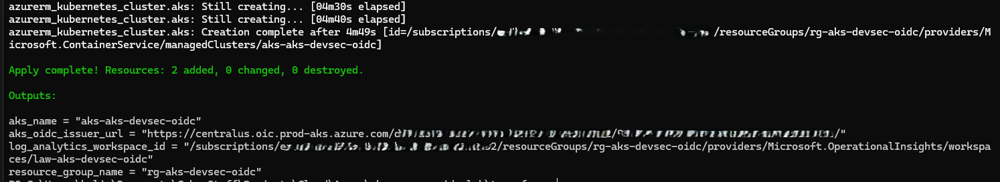

## AKS Cluster Configuration

This lab provisions and configures an Azure Kubernetes Service (AKS) cluster using Terraform. The cluster serves as the runtime environment for the workload identity and secure secret retrieval workflow.

Key cluster configurations include:

- OIDC issuer enabled for workload identity federation

- Azure Managed Identity integration

- Kubernetes service account federation

- CSI driver support for external secret providers

- Pod identity mapping via service account annotations

The cluster acts as the trust boundary between Kubernetes workloads and Azure services.

This configuration demonstrates how secure workloads authenticate to Azure resources without storing credentials in the cluster.

## Workload Identity Federation

Workload identity federation enables Kubernetes service accounts to authenticate to Azure AD using OIDC tokens issued by the AKS cluster. This replaces older secret-based identity patterns and minimizes credential management risk.

The service account is federated with an Azure Managed Identity, allowing pod workloads to authenticate securely without client secrets.

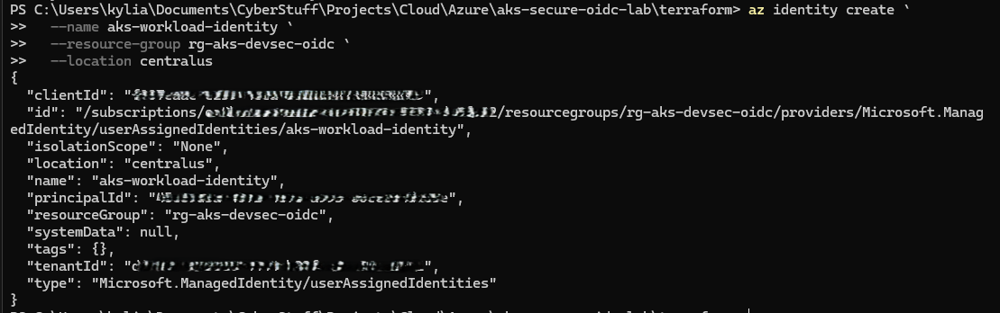

## Secret Injection via Key Vault

Secrets are stored centrally in Azure Key Vault and retrieved on demand using the Secrets Store CSI Driver. The Kubernetes `SecretProviderClass` defines which Key Vault secrets are projected into the pod.

This ensures secrets are not hardcoded into manifests and are not persisted as static credentials in container images.

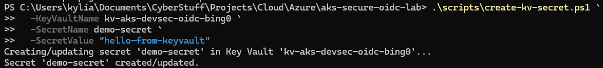

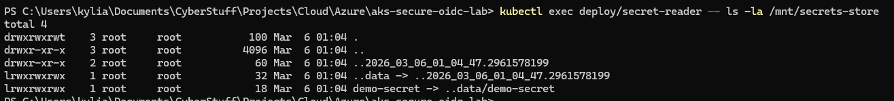

## Application Consuming Secret

The sample Kubernetes deployment mounts the Key Vault secret into the container at runtime. The application reads the mounted file and demonstrates successful secret retrieval during execution.

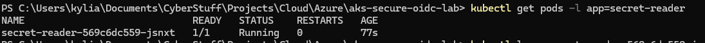

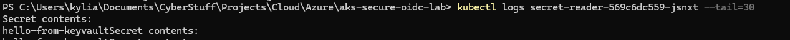

## Secret Rotation Demonstration

The lab validates runtime secret rotation by updating the value in Azure Key Vault and confirming that the updated secret is propagated to the running workload via the CSI integration.

This demonstrates operational resilience and reduced blast radius compared to manually rotated static secrets.

The secret value is updated in Azure Key Vault using a rotation script, which creates a new secret version.

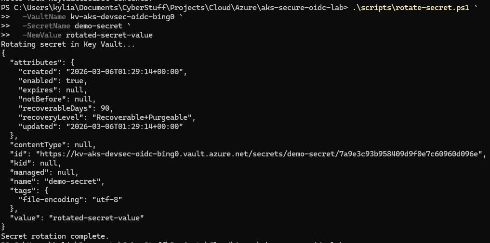

## Security Scanning

Trivy is used to perform security scanning across multiple layers of the stack:

- Terraform infrastructure
- Kubernetes manifests
- Container images

These scans help identify misconfigurations and vulnerabilities early in the CI pipeline before infrastructure and workloads are deployed.

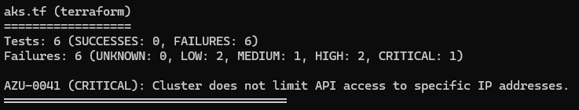

### Kubernetes Manifest Scan

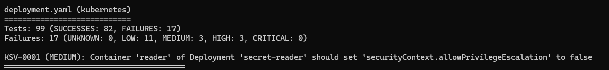

### Container Image Scan

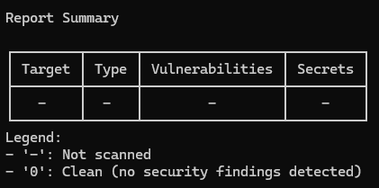

## CI Security Pipeline

GitHub Actions runs automated security checks on push and pull request events using the workflow defined in `.github/workflows/security-scan.yml`.

The pipeline executes Trivy scans across Terraform infrastructure, Kubernetes manifests, and container images to detect vulnerabilities and misconfigurations during the CI stage.

This demonstrates a shift-left DevSecOps approach where security checks are enforced before infrastructure and workloads are deployed.

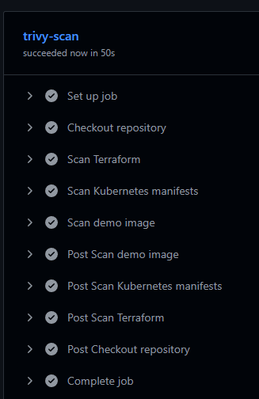

## Repository Structure

```text
.github/workflows/
	security-scan.yml

terraform/
	main.tf
	aks.tf
	network.tf
	providers.tf
	variables.tf
	outputs.tf
	terraform.tfvars.example

kubernetes/
	deployment.yaml
	serviceaccount.yaml
	secretproviderclass.yaml

scripts/
	connect-aks.ps1
	create-kv-secret.ps1
	create-workload-identity.ps1
	enable-csi-token-requests.ps1
	grant-kv-secrets-officer-to-me.ps1
	grant-kv-secrets-user.ps1
	install-csi-driver.ps1
	install-kubectl.ps1
	kv-can-access-secret.ps1
	kv-check-secret-metadata.ps1
	kv-list-role-assignments.ps1
	kv-verify.ps1
	rotate-secret.ps1

security/
	trivy-scan.ps1

patches/
	csidriver-tokenrequests.json

docs/images/
	(screenshots demonstrating each step)
```

## Key DevSecOps Concepts Demonstrated

- Infrastructure as Code (IaC) security
- Kubernetes workload identity (OIDC federation)
- Cloud secret management with Azure Key Vault
- Runtime secret rotation
- DevSecOps security scanning with Trivy
- CI security automation with GitHub Actions

## Cleanup

When you are finished with the lab, remove all provisioned infrastructure to avoid unnecessary cloud cost:

```bash
terraform destroy
```
